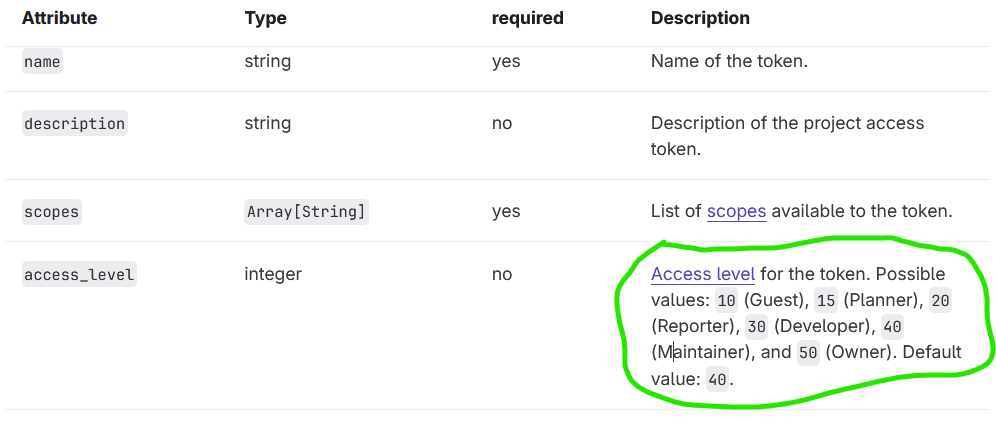

# B3 Production

### URL to the server
<a>https://cscloud9-62.lnu.se/</a>


## Basic Requirements Implemented

*To run locally, simply run the following command:*

```sh
npm install
npm start # runs in production (NODE_ENV)
```

**But this will not work for real time web, that only works on the production server!**

## Security Measures:
*In general I went through the checklist of top 10 vulnerabilities mentioned in the [OWASP](https://owasp.org/www-project-top-ten/) article!* However, some points were somewhat irrelevant, e.g injection attacks and Software, Data Integrity Failures and SSRF...

- The express server uses the helmet package, for setting security related HTTP response headers.
- Preventing CSRF (Cross-site request forgery) attacs by setting a state: "a value that can’t be predicted used by the client to maintain state between the request and callback". It is done in the GitLab Oauth flow, before anything happens, a state is set. 
- Since comments are the only place where user input is accepted I paid special attention to sanitizing and validating the input before processing:
    ```sh
    const { comment } = req.body
        if (typeof comment !== 'string' || comment.length === 0 || comment.length > 1000) {
        return res.status(400).send('Invalid comment')
        }
    ```

    So, I make sure the comment is a string, and that is at least 1 character but less than 1000.

- Secured cookies using HTTPS (parameter of the session middleware)


### Security Measure for the application server! 
- Certified HTTPS has been set up using Lets Encrypt and cert bot! 
- I am using NGINX of course to serve as a secure reverse proxy, adding a layer of separation and protection between the public internet and the application.


## Extra requirements

- I implemented a richer UI
- Implemented a button to close an issue
- Implemented commenting in issues, using gitLabs API
- Implemented commits
- GitLab Oauth

## GitLab Oauth

Initially the implementation of this follows the documentation for the authorization code flow: [GitLab Oauth 2.0 auth code flow](https://docs.gitlab.com/api/oauth2/#authorization-code-flow)


### Documentation
- The projects for a logged-in user are fetched using the
[GitLab API docs for projects](https://docs.gitlab.com/api/projects/#list-all-projects)
- The webhooks are created dynamically for each user project using [GitLab API for creating webhooks for user projects](https://docs.gitlab.com/api/project_webhooks/#add-a-webhook-to-a-project)

Only projects with **owner** or **Maintainer** access level can be used for the required actions of this app so in the code I refer

